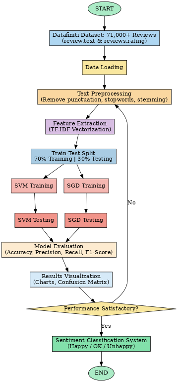
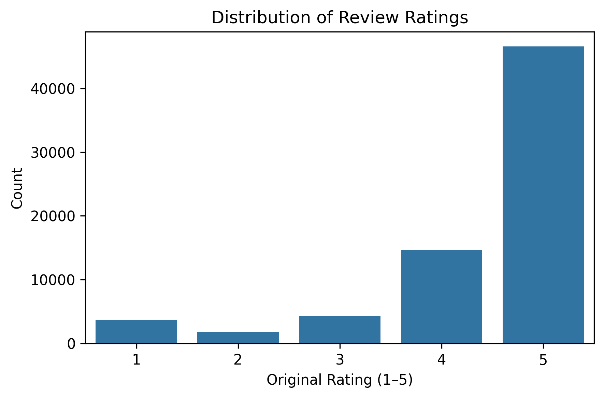
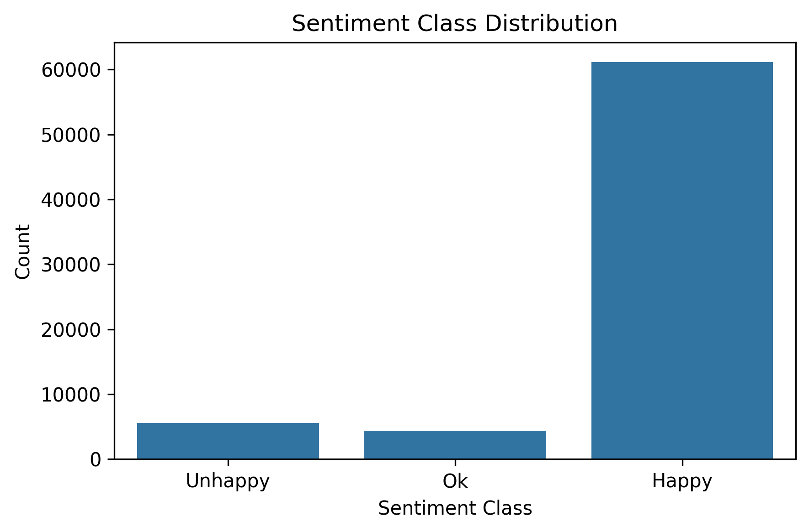
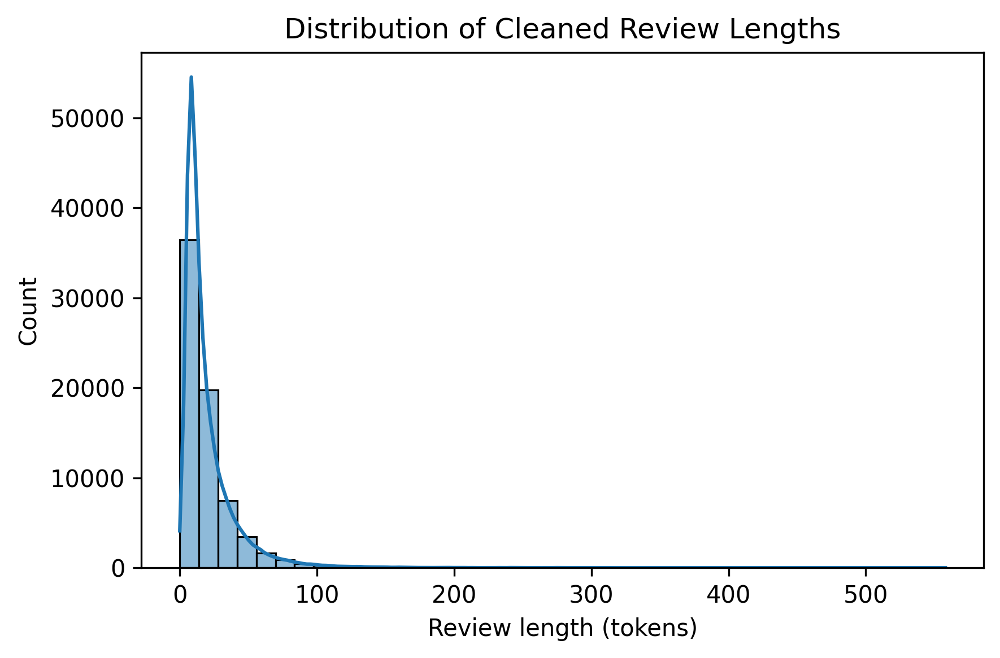
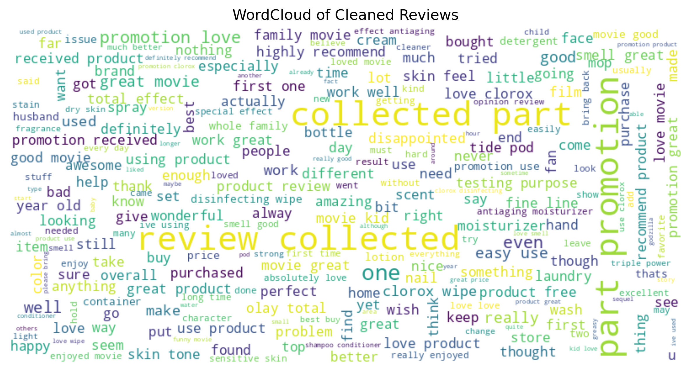
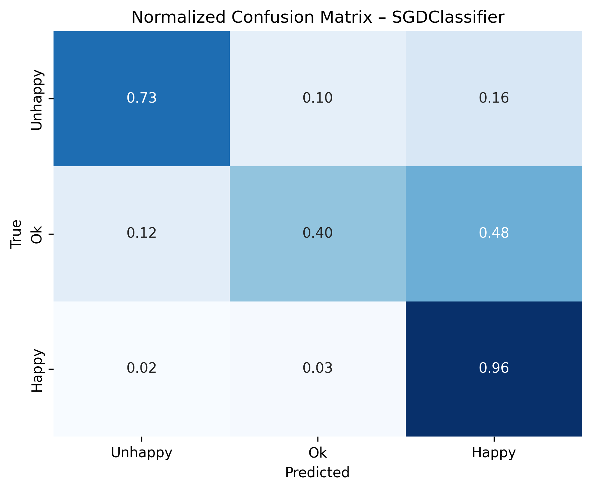
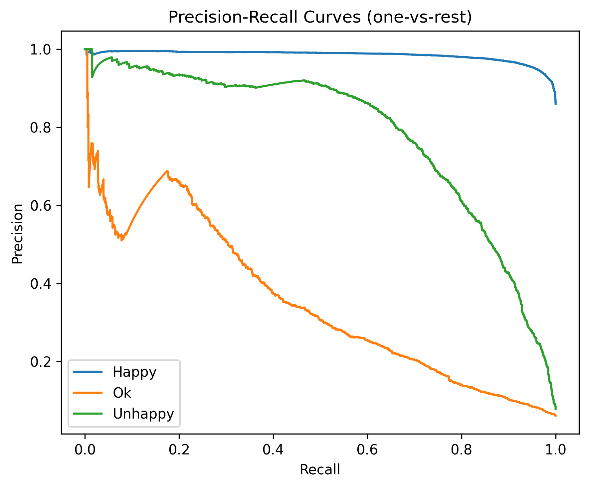
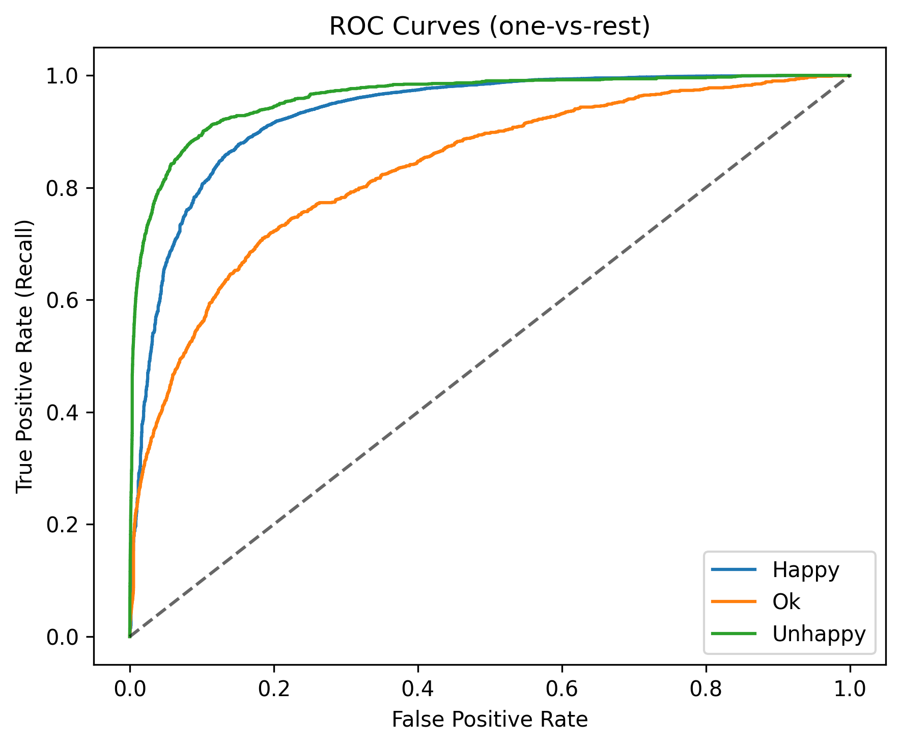
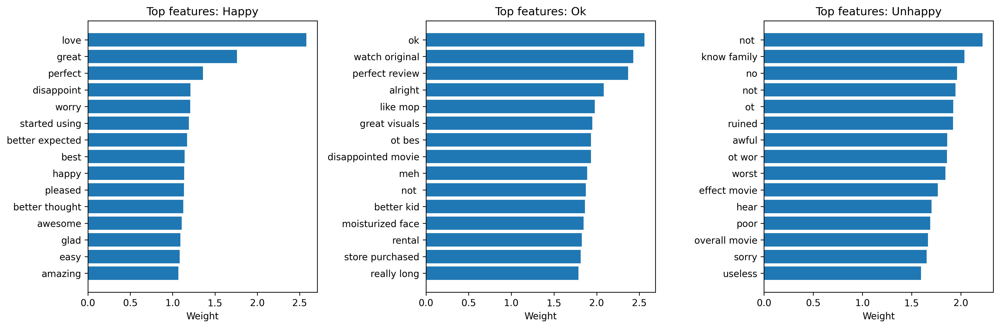
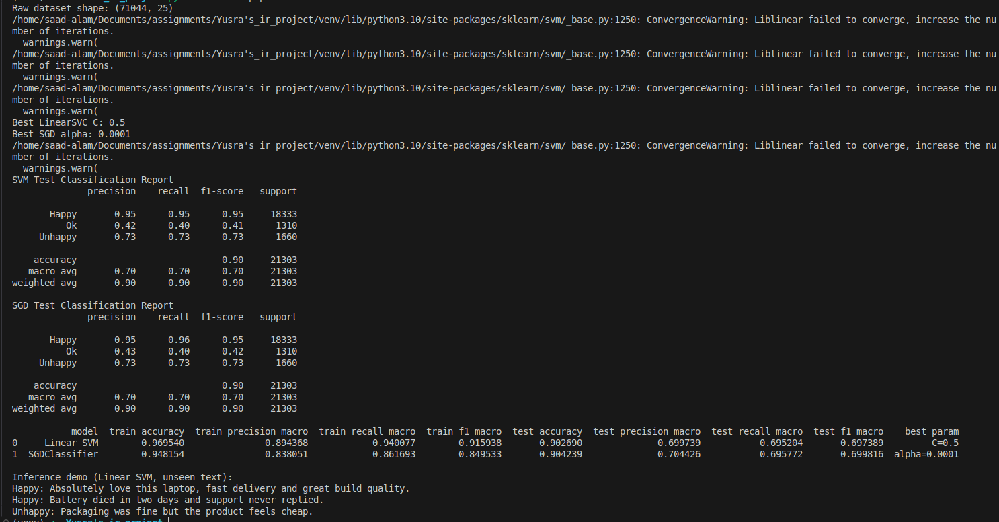

# Opinion Mining of E-Commerce Reviews

Course: CS-516 – Information Retrieval and Text Mining (ITU, Fall 2025)  
Team: Aqsa Taqdees (MSDS23012), Ghulam Ruqia (MSDS23013), Yusra Qayyum (MSDS25036)

---

We classify e-commerce product reviews into **Happy / Ok / Unhappy** using a TF-IDF + linear-model stack (SVM + SGD) with stratified train/test split, reusable artifacts for inference, and ready-made visualizations for reporting.

*(We currently operationalize the TF-IDF component; BM25 and embedding scores can be added as weighted signals for future ensemble experiments.)*

## Repository Map
```
Yusra's_ir_project/
├─ config/
│  └─ config.yaml              # Paths, preprocessing flags, split + model settings
├─ data/
│  ├─ raw/                     # Place 245_1.csv here
│  └─ processed/               # reviews_clean.parquet after pipeline
├─ results/
│  ├─ results.csv              # Saved metrics from the latest pipeline run
│  ├─ results_summary.csv      # Legacy path for notebooks
│  ├─ demo_predictions.csv     # Inference samples from pipeline
│  ├─ sample_misclassified_svm.csv
│  └─ artifacts/               # TF-IDF vectorizers + Linear SVM joblib files
├─ assets/                     # All generated figures (see Visual Gallery)
├─ notebooks/
│  └─ 01_sentiment_analysis_eda_and_models.ipynb  # EDA + narrative + live experiments
├─ src/
│  ├─ pipeline.py              # End-to-end training + saving outputs + demo inference
│  ├─ inference.py             # Console inference on unseen text using saved artifacts
│  ├─ data_loader.py           # CSV reader helpers
│  ├─ preprocessing.py         # Cleaning + rating→sentiment mapping
│  ├─ features.py              # TF-IDF vectorizers + inference helper
│  ├─ models.py                # Train/test split, trainers, light tuning grids
│  └─ evaluation.py            # Metric summaries
└─ utils/
   └─ visualization.py         # Plots (distributions, curves, confusion matrices, top features)
```

## Data & Preprocessing (where the train/test split lives)
- Dataset: Datafiniti Online Product Reviews (~71k rows, 25 columns).
- Core columns: `reviews.text` (features), `reviews.rating` (labels), `reviews.didPurchase` (context feature for analysis).
- Label mapping: ratings **1–2 → Unhappy**, **3 → Ok**, **4–5 → Happy** via `src/preprocessing.py:map_ratings_to_sentiment`.
- Cleaning steps (`src/preprocessing.py:clean_text` driven by `config/config.yaml`):
  - Lowercasing, URL/HTML removal, digit and punctuation stripping.
  - Contraction expansion (`don't` → `do not`), negation-aware stopwords (keep no/not/never), lemmatization (fallback to stemming).
- Stratified train/test split implemented in `src/models.py:train_test_split_data` with a 70/30 ratio (`config.split.test_size = 0.3`), keeping class proportions consistent across splits.

## Feature Engineering & Models
- **Word-level TF-IDF**: 1–2 grams, max features=20k, sublinear TF.
- **Character-level TF-IDF**: 2–6 grams, max features=80k (captures misspellings and affixes).
- **Class weighting**: `class_weight="balanced"` for both Linear SVM and SGD hinge loss to handle class imbalance.
- **Light hyperparameter search**: small grids for Linear SVM (`C`) and SGD (`alpha`) over a validation split (configurable).
- Future-ready MLE tweaks (drop-in):
  1) Add BM25 scores (rank_bm25) and average sentence embeddings (e.g., MiniLM) into the hybrid-score weights above.  
  2) Try bigram/trigram word TF-IDF and calibration (CalibratedClassifierCV) to improve PR curves.  
  3) Apply threshold tuning/upsampling/focal loss to lift the minority **Ok** class.

## How to Run (pipeline + notebook)
1) Python 3.9+  
2) Create env  
```
python -m venv .venv
# Windows: .venv\Scripts\activate
# macOS/Linux:
source .venv/bin/activate
```
3) Install deps  
```
pip install --upgrade pip
pip install -r requirements.txt
```
4) Place data  
```
mkdir -p data/raw
# copy 245_1.csv here
```
5) Train, evaluate, visualize, and save artifacts  
```
python -m src.pipeline
```
Outputs:
- Processed data: `data/processed/reviews_clean.parquet`
- Figures refreshed in `assets/`
- Metrics: `results/results.csv` (also `results_summary.csv` for notebook compatibility)
- Artifacts for reuse: `results/artifacts/tfidf_word.joblib`, `tfidf_char.joblib`, `svm_model.joblib`
- Demo predictions saved to `results/demo_predictions.csv`
- Console: classification reports + on-the-fly inference for a few unseen reviews

Notebook option: open `notebooks/01_sentiment_analysis_eda_and_models.ipynb` (use the `.venv` kernel) to walk through EDA, feature inspection, and run inference cells that reuse the Python modules instead of one-off notebook code.

## Inference on Unseen Text (real-time console or quick strings)
- Fast path with saved artifacts (no retraining):
```
python -m src.inference --text "Absolutely love this laptop, fast delivery and great build quality." \
                        "Battery died in two days and support never replied."
# Expected: Happy, Unhappy
```
- Interactive console mode:
```
python -m src.inference --interactive
> Packaging was fine but the product feels cheap.
# Expected: Unhappy / Ok (borderline)
> (empty line to exit)
```
- Artifacts missing? Run `python -m src.pipeline` first to train and save them.

## Results Snapshot (from `results/results.csv`)
| Model         | Train Acc | Test Acc | Test Precision (macro) | Test Recall (macro) | Test F1 (macro) | Best Param    |
|---------------|-----------|----------|------------------------|---------------------|-----------------|---------------|
| Linear SVM    | 0.970     | 0.903    | 0.700                  | 0.695               | 0.697           | C=0.5         |
| SGDClassifier | 0.948     | 0.904    | 0.704                  | 0.696               | 0.700           | alpha=0.0001  |

Notes:
- Macro metrics highlight the challenge on the minority **Ok** class.
- Character n-grams mitigate spelling noise; class weighting tempers imbalance.
 - Convergence warnings suggest increasing max iterations if you further widen the grid.

## Visual Gallery (all images live in `assets/`)
### Workflow

- Shows the end-to-end path from raw CSV → preprocessing → TF-IDF → tuning → evaluation → saved artifacts.

### Rating Histogram

- Ratings are skewed toward 4–5 stars, motivating class weighting and stratified splits.

### Sentiment Distribution

- After mapping, Happy dominates; Ok is minority—expect lower macro-F1 without balancing.

### Length Distribution

- Most cleaned reviews are short-to-medium; character n-grams help with spelling noise in short texts.

### Word Cloud

- Frequent positive terms stand out; some defect terms remain, showing mix of praise and complaints.

### SVM Confusion Matrix

- Errors concentrate on the Ok class (borderline sentiment); Happy/Unhappy separation is strong.

### SGD Confusion Matrix

- Similar pattern to SVM with slight shifts; minority Ok still hardest to catch cleanly.

### SVM PR Curves

- Happy has high precision/recall; Ok curve is shallow, confirming imbalance pain point.

### SVM ROC Curves

- All classes show good separation; Ok has the lowest AUC, again reflecting minority difficulty.

### Top Features (SVM)

- Positive weights highlight quality/performance terms; negative weights capture defect/return cues.

### Console Screenshot

- Project workspace snapshot useful for slide decks or demo context.

## Quick Guidance for Reuse and Extension
- **Modules over notebooks**: all heavy lifting lives in `src/` and `utils/`; notebooks only orchestrate and visualize.
- **Hyperparameters**: tweak TF-IDF ranges, max_features, and SVM/SGD settings in `config/config.yaml`.
- **Metrics & reports**: extend `results/results.csv` with per-class stats or confusion-matrix summaries as needed.
- **Hybrid/ensemble idea**: fuse TF-IDF scores with BM25 or sentence embeddings, weighting them via the hybrid score above for more nuanced ranking.
